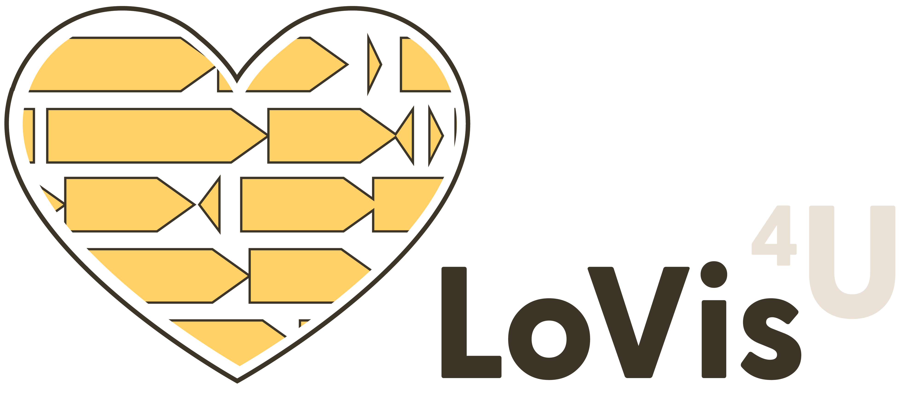
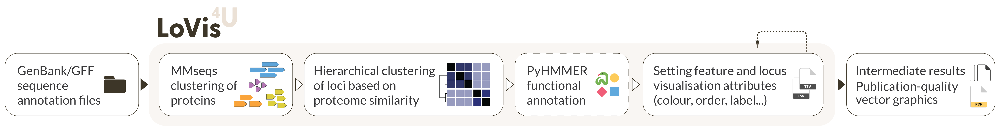
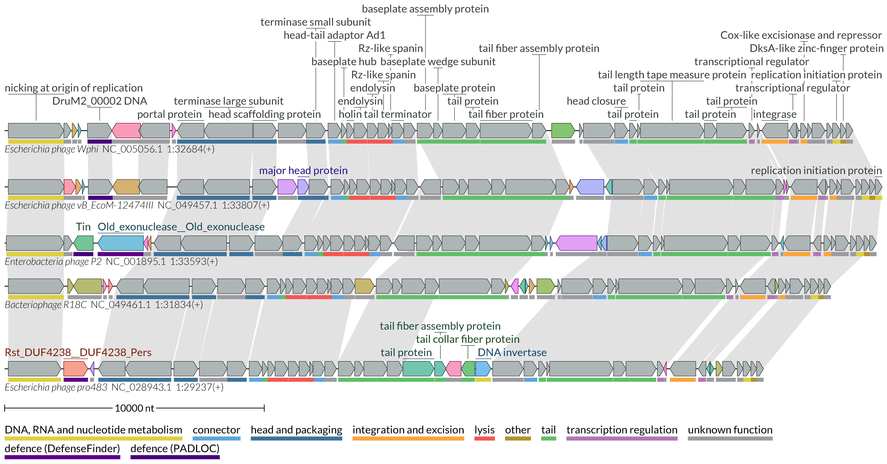
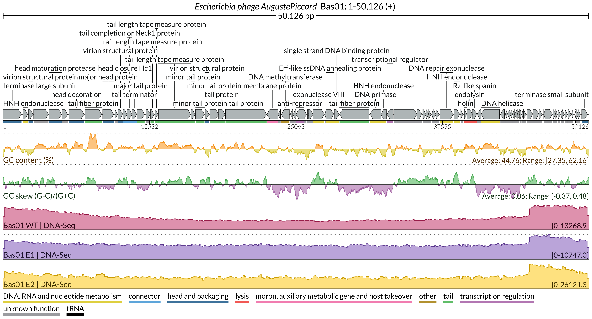

## Description

## Description

**LoVis4u** is a bioinformatics tool for **Lo**cus **Vis**ualisation and coverage profiles from sequencing experiments.

**Supported genome annotation input**: Genbank, gff3 with sequence    
**Supported coverage profile input**: bedGraph, bigWig  
**Supported output**: Static vector graphics (pdf)   
**Programming language:** Python3   
**OS:** MacOS, Linux  
**Python dependencies:** biopython, bcbio-gff, scipy, configs, pandas, distinctipy, matplotlib, seaborn, reportlab, pyhmmer, progress, requests  
**Python version:** >= 3.8  
**OS-level dependencies:** MMseqs2, bigWigToBedGraph (included in the package)  
**License:** WTFPL  
**Version:** 0.1.1 (January 2024)

**Detailed documentation with user guide is available at [LoVis4u Homepage](https://art-egorov.github.io/lovis4u/)**


**Pipeline:**


**Visualisation example (comparative gemomics)**



**Visualisation example (genomic signal tracks from sequencing experiments)**




See the [gallery page](https://art-egorov.github.io/lovis4u/Gallery/gallery/) for more examples.


## Installation

- LoVis4u can be installed directly from pypi:

```
python3 -m pip install lovis4u
```

- The development version is available at github :

```
git clone https://github.com/art-egorov/lovis4u.git
cd lovis4u
python3 -m pip install --upgrade pip
python3 -m pip install setuptools wheel
python3 setup.py sdist
python3 -m pip install -e .
```

**!** If you're a linux user, run `lovis4u --linux` post-install command once to update paths in the premade config files that set by default for MacOS users.


## Reference 

If you find LoVis4u useful, please cite:  
Artyom. A. Egorov, Gemma C. Atkinson, **LoVis4u: Locus Visualisation tool for comparative genomics**, *bioRxiv 2024.09.11.612399; doi: [10.1101/2024.09.11.612399](https://doi.org/10.1101/2024.09.11.612399)*

## Contact 

Please contact us by e-mail _artem**dot**egorov**AT**med**dot**lu**dot**se_ or use [Issues](https://github.com/art-egorov/lovis4u/issues?q=) to report any technical problems.  
You can also use [Discussions section](https://github.com/art-egorov/lovis4u/discussions) for sharing your ideas or feature requests! 

## Authors 

LoVis4u is developed by Artyom Egorov at [the Atkinson Lab](https://atkinson-lab.com), Department of Experimental Medical Science, Lund University, Sweden. We are open for suggestions to extend and improve LoVis4u functionality. Please don't hesitate to share your ideas or feature requests.
