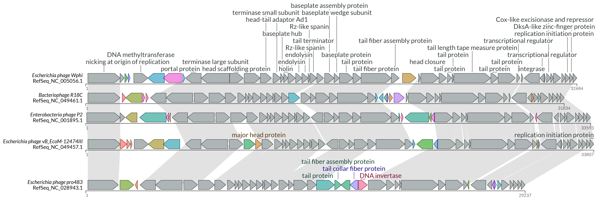

# Example-driven guide

Here we show usage examples of the lovis4u command-line interface. Through this guide we will show you step-by-step how to optimise your visualisation starting from default parameters.

## Before start

### Data preparation 

The necessary sample data as well as adjustable tool configuration files are provided by lovis4u at the post-install step with the command:    
`lovis4u --data` This copies the *lovis4u_data* folder to your working directory.
  
**If you work on a Linux machine:** after installation you should run: `lovis4u --linux`  
This command replaces the tool path (for MMseqs2) in the pre-made config files from the MacOS version (default) to the Linux version.
If you run this command for fun and want to change it back you can use `lovis4u --mac`.

^^For demonstration we will use pharokka generated gff files with the sequences of five Enterobacteria phages.
Gff files are stored at: lovis4u_data/guide/gff_files.^^      
The main difference between pharokka generated gff files and regular gff3 (for ex. which you can download from the NCBI) is that in addition to the annotation rows the annotation contains the corresponding nucleotide sequence in fasta format.

### Building compatible gff files based on nucleotide sequences

If your query set of sequences for visualisation contains only nucleotide fasta files, below we will provide the efficient way of using [pharokka](https://pharokka.readthedocs.io/en/latest/) (phage annotation pipeline) and [prokka](https://github.com/tseemann/prokka) (prokaryotic genome annotation pipeline) for preparing gff files compatible with LoVis4u. 

#### Using pharokka for annotation of phage genomes

Before running pharokka you need to install pharokka databases (and pharokka itself, of course). Due to the number of non-python dependencies we recommend using a conda environment for this task. See [pharokka documentation page](https://pharokka.readthedocs.io/en/latest/install/) for clear instructions.

Firstly, you can merge multiple sequences into one fasta file (could be done simply by using cat: `cat folder_with_fasta_files/*.fa > merged_fasta.fa`.  
We recommend to merge multiple sequences to one file and using meta mode since in that case we do not load databases for each contig while annotating. 
  
Then, you can use pharokka in meta mode with one command:  
```sh
pharokka.py -i merged_fasta.fa  -o pharokka_output  --meta --split -t Num_of_threads \
	--skip_mash --dnaapler  -database path_do_pharokka_database 
```

Gff files for each query contig will be stored at: *pharokka_output/single_gffs*

#### Using prokka for annotation of prokaryotic genomes

Prokka does not have an equivalent of meta mode which we used in pharokka in the example above. Therefore, for any number of input sequences we prefer running prokka independently for each contig instead of dividing more complex gff files, which requires an additional step. Again, for prokka installation instruction and parameter description see  [prokka documentation page](https://github.com/tseemann/prokka).

In case your input fasta query files (^^one sequence per file^^) are located in *single_records* folders you can run:
```sh
for f in single_records/*.fa;  do fb=$(basename $f); nm=${fb//.fa/}; \ 
	echo prokka --outdir prokka/$nm --prefix $nm --quiet --cpus 1 $f ; \
	done | parallel -j num_of_available_threads
```
Then you can move generated gff files to one folder using:
```sh
for f in prokka/*; do fb=$(basename $f); echo mv  $f/$fb.gff prokka_gffs/ ; done | parallel
```


## Example run with default parameters

Let's start with running lovis4u without using any optional arguments. The only mandatory argument is a folder path containing pharokka generated gff (`-gff`) files or genbank files (`-gb`).   

```sh
lovis4u -gff lovis4u_data/guide/gff_files
``` 

Running this command will create an output folder named *lovis4u_{current_date}* (e.g. *lovis4u_2024_04_28-16_36*) containing the results files. The name of the output folder can be changed with `-o <output_folder_name>`.

??? card_hearts "**Output folder structure**" 

	- *lovis4u.pdf* - vector graphic output (file name can be changed with `--pdf-name <filename>` parameter)  
	- *locus_annotation_table.tsv* - table containing annotation (sequence_id, length, coordinates, etc.) for each locus.  
	- *feature_annotation_table.tsv* - table containing annotation (feature_id, locus_id, coordinates, etc.) for each feature (e.g. CDS)  
	- *mmseqs* (folder)  
		- *DB* - folder with MMseqs databases.  
		- *mmmseqs_clustering.tsv* - table with proteomes clustering results.  
		- *mmmseqs_(stdout/stderr).txt* - mmseqs logs.  
		- *input_proteins.fa* - fasta file with all annotated protein sequences (input to mmseqs).  
	- *proteome_similarity_matrix.tsv* - pairwise proteome similarity scores indicating the fraction of shared proteins homologues.  


{loading=lazy width="100%" }  

**By default, lovis4u uses the following data pre-processing steps:**

1.	The full length of each input sequence is taken for analysis (this can be adjusted using the locus annotation table, see below).. 
2.	All proteins annotated to be encoded on input sequences are used as input for MMseqs2 clustering (can be deactivated with --mmseqs-off parameter). MMseqs2 arguments can be adjusted using config file. Proteins clustered together are considered to be a set of homologues. Based these results, the "group" attribute of each CDS is set.
3.	Taking into account the information about the set of homologues from the previous step, lovis4u applies similarity based hierarchical clustering of proteomes, which it uses to find the optimal order for visualisation and sets the "group" attribute for each locus. The purpose is to group together only related proteomes (keeping the average proteome set similarity > ~80%). This step can be skipped with the `-cl-off, --clust_loci-off` parameter.
4.	Defining the feature attribute "group_type". This allows the use of parameters that refer to a particular set of feature groups (e.g. set colour or show labels only for "group_type" = "variable"). By default it sets group_type "variable" for CDS features that are found in less than 0.25 of loci within the locus group, and "conserved" for others that are less variable. 
5.	Setting feature colour based on the feature "group" attribute (can be deactivated with -sgc-off or --set-group-colour-off). By default loVis4u sets distinct colours only for features with group_type "variable". You can change this with -sgcf or --set-group-colour-for. For example, if you want to set colour only for features with group_type "conserved", run `--set-group-colour-for conserved`. 
6.	Defining labels to be shown. By default, lovis4u shows all labels for "variable" features and only the first occurrence for "conserved" features. You can show all labels with `--show-all-feature-labels` or specify group types for which all labels will be shown with `-sflf, --show-feature-label-for <classes>`. Additionally, by default lovis4u ignores the following labels: hypothetical protein, unknown protein. The list of ignored labels can be set with `-ifl, --ignored-feature-labels <feature_label1 [feature_label2 ...]>`. The list with this argument can be left empty to not filter out labels by their name.

**The following parameters are particularly useful for basic runs:**

- `--reorient_loci` - Auto re-orient loci (set new strands) if they are not matched.  This function tries to maximise co-orientation of homologous features.
- `-hl`, `--homology-links` - Draw homology link track (Sankey graph).
- `-o <name>` - Output dir name.  

While loci in our test set are already correctly orientated, let's add -hl parameter to update the output.

```sh
lovis4u -gff lovis4u_data/guide/gff_files  -hl -o lovis4u_output
```
{loading=lazy width="100%" }  

## Using the locus annotation table 

As mentioned above, the full length of each locus is taken for visualisation by default. However, you can also specify the sub-coordinates of multiple regions for each locus to be shown. The coordinates together with other information about each locus can be specified in the locus annotation table and used as input with  `-laf` or `--locus-annotation-file` parameter. 

Additionally, after each run lovis4u saves the *locus_annotation_table.tsv* with annotation parameters used in this particular run. If no table was specified by input then all annotation columns are set with default values.  

*Default table generated from previous runs:*

{{ read_table('locus_annotation_table.tsv', sep = '\t') }} 

The locus annotation table can also be used as input for customising the regions and orientations of the sequences shown. After the default run we can take the output locus_annotation_table and edit the information we want to change.  
**Important to note**: it is possible to input a table containing only a subset of columns (only the sequence_id column is essential). For other columns or empty cells, lovis4u will set the default values.

For example, let's use this table as input:

{{ read_table('locus_annotation_table_alt.tsv', sep = '\t') }} 

Here we specified only the coordinates, order and group for each locus. Order and group are also specified and kept since it is logical to use clustering results defined during the full locus length run, and to turn off a new attempt to cluster sequences. This is done with the `-cl-off, --clust_loci-off` parameter.   

**Format for coordinates specification:** comma-separated list of start\:end:strand. Start and end are in 1-based format, strand: 1 for plus strand and -1 for minus.

The table can be found in the guide folder: *lovis4u_data/guide/locus_annotation_table_alt.tsv*

Now we can run: 
```sh
lovis4u -gff lovis4u_data/guide/gff_files  -hl -o lovis4u_output \
	--locus-annotation-file lovis4u_data/guide/locus_annotation_table_alt.tsv -cl-off
```
{loading=lazy width="100%" }  


## Using the feature annotation table 

Similarly to the locus annotation table, we can use the the feature annotation table to adjust the feature visualisation parameters. Here, feature usually refers to an open reading frame, each of which has its own ID.  After each run, a feature_annotation_table.tsv file is saved in your output folder. Below you can see header of default table created with default parameter run.

{{ read_table('feature_annotation_table_alt_header.tsv', sep = '\t') }} 

As with the locus annotation table, we can tweak the parameters and use this as input in subsequent runs.  This is done with the parameter `-faf, --feature-annotation-file`, a table that contains only the subset of annotation columns that are of interest. For example, you can specify a new label and colour for those particular coding sequences (CDS) that you are interested in.

{{ read_table('feature_annotation_table_alt.tsv', sep = '\t') }} 

This table can be found in the guide folder: *lovis4u_data/guide/feature_annotation_table_alt.tsv*

```sh
lovis4u -gff lovis4u_data/guide/gff_files  -hl -o lovis4u_output \
	--locus-annotation-file lovis4u_data/guide/locus_annotation_table_alt.tsv -cl-off \
	--feature-annotation-file lovis4u_data/guide/feature_annotation_table_alt.tsv
```
{loading=lazy width="100%" }  


Here it is also **important to note** that if you don't use the feature attribute "group_type" defined by the full locus run, then this will be re-defined by mmseqs using on the subset of proteins found only in the specified coordinates given in the locus annotation table. You can deactivate re-definition of group types with `--find-variable-off` and `--mmseqs-off`). This avoids a situation where an ORF is labelled "variable", when in reality it is encoded in each proteome, but outside of the coordinates shown.

## Other features

### Category colour and annotation 

Using the parameter `--set-category-colour` you can use the functional category annotation column for features. The functional category is shown by coloured lines below each ORF. By default it was designed to parse the PHROGs category annotation for proteins and retrieve information about the category in the "function" qualifiers in Genbank or GFF files (qualifiers used can be changed in config file). However, you can set the category for each CDS using the above feature annotation table and the "category" column. Additionally, you can set the colour codes for your categories using `--category-colour-table`. For categories that are not found in a table, a random colour will be set. By default, lovis4u uses a pre-made colour table found in *lovis4u_data/category_colours.tsv*.

```sh
lovis4u -gff lovis4u_data/guide/gff_files -hl --set-category-colour
```
{loading=lazy width="100%" }  


### Using a scale line instead of individual x-axis

Using the parameter `--hide-x-axis` you can deactivate visualisation of the x-axis for each locus track and instead, if you wish, draw a scale line track below. This is done using with `-slt, --scale-line-track`.

```sh
lovis4u -gff lovis4u_data/guide/gff_files -hl --hide-x-axis --scale-line-track
``` 
{loading=lazy width="100%" }  


### Highlighting conserved genes instead of variable

For many analysis purposes (e.g. conserved neighbourhood visualisation), it is more useful to colourise conserved gene clusters instead of the variable genes. This can be easily switched in lovis4u using the `--set-group-colour-for` parameter. Te default is to colour by variable but using `--set-group-colour-for conserved` will change it to the opposite mode.  
**Note** that if you have other feature group set in your feature annotation table and you want to set auto-colourising for them as well, you can specify them in a space separated list with this argument (e.g. `--set-group-colour-for conserved your_group_1 your_group_2`).

```sh
lovis4u -gff lovis4u_data/guide/gff_files -hl --set-group-colour-for conserved
```

{loading=lazy width="100%" }  


**Note:**By default, the colours for groups are randomly set for each group using the [seaborn husl palette](https://seaborn.pydata.org/tutorial/colour_palettes.html). In the config file you can change to a more intense hsl palette or change the desaturation parameter.

### Specifying figure width

Lovis4u tries to set an optimal figure width taking into account the nucleotide size of visualisation window. You can change it in two ways:  
1) Using the `--mm-per-nt <float value>` argument changing scale which defines given space for each nt cell on canvas. Default: 0.0022 - 0.02, depending on window size.  
2) With `-fw, --figure-width <float value [cm]>` parameter which defines the total output figure width in cm.  

Here we demonstrate usage by plotting a compact visualisation of full loci together with `--show-first-feature-label-for` argument with an empty list, so not labelling the first occurrence of conserved genes. Note that most of the coloured, variable genes are not labeled in this figure as they are annotated as ‘hypothetical protein’, which LoVis4u ignores to make figures more compact and informative.

```sh
lovis4u -gff lovis4u_data/guide/gff_files -hl -o width_test --show-first-feature-label-for --figure-width 7
```
{loading=lazy width="100%" }  


