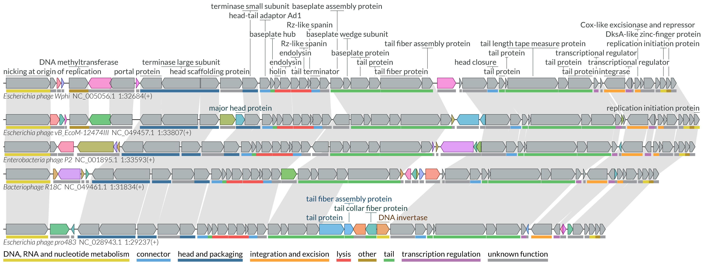

# Example-driven guide

Here we show usage examples of the lovis4u command-line interface. Through this guide we will show you step-by-step how to optimise your visualisation starting from default parameters.

## Before start

### Data preparation 

The necessary sample data as well as adjustable tool configuration files are provided by lovis4u at the post-install step with the command:    
`lovis4u --data` This copies the *lovis4u_data* folder to your working directory.
  
**If you work on a Linux machine:** after installation you should run: `lovis4u --linux`  
This command replaces the tool path (for MMseqs2) in the pre-made config files from the MacOS version (default) to the Linux version.
If you run this command for fun and want to change it back you can use `lovis4u --mac`.

**Downloading HMM models:** LoVis4u uses pyhmmer for additional functional annotation of proteins with hmmscan versus a set of databases. You can download these database from our server ([data-sharing.atkinson-lab.com/LoVis4u](https://data-sharing.atkinson-lab.com/LoVis4u/)) by running the following command:  
`lovis4u --get-hmms`  
List of databases: AMR: AMRFinderPlus (v. 02.05.2024.2); Anti-defence: dbAPIS_Acr (v. 19.09.2023); Defence: DefenceFinder (v. 1.2.4), CasFinder (v. 3.1.0), PADLOC (v. 22.10.2024); Virulence: VFDB (v. 10.05.2024).

^^For demonstration we will use pharokka generated gff files with the sequences of five Enterobacteria P2-like phages.
Gff files are stored at: lovis4u_data/guide/gff_files.^^      
The main difference between pharokka generated gff files and regular gff3 (for ex. which you can download from the NCBI) is that in addition to the annotation rows the annotation contains the corresponding nucleotide sequence in fasta format.

---

### Building compatible gff files based on nucleotide sequences

If your query set of sequences for visualisation contains only nucleotide fasta files, below we will provide the efficient way of using [pharokka](https://pharokka.readthedocs.io/en/latest/) (phage annotation pipeline) and [prokka](https://github.com/tseemann/prokka) (prokaryotic genome annotation pipeline) for preparing gff files compatible with LoVis4u. 

#### Using pharokka for annotation of phage genomes

Before running pharokka you need to install pharokka databases (and pharokka itself, of course). Due to the number of non-python dependencies we recommend using a conda environment for this task. See [pharokka documentation page](https://pharokka.readthedocs.io/en/latest/install/) for clear instructions.

Firstly, you can merge multiple sequences into one fasta file (could be done simply by using cat: `cat folder_with_fasta_files/*.fa > merged_fasta.fa`.  
We recommend to merge multiple sequences to one file and using meta mode since in that case we do not load databases for each contig while annotating. 
  
Then, you can use pharokka in meta mode with one command:  
```sh
pharokka.py -i merged_fasta.fa  -o pharokka_output  --meta --split -t Num_of_threads \
	--skip_mash --dnaapler  -database path_do_pharokka_database 
```

Gff files for each query contig will be stored at: *pharokka_output/single_gffs*

#### Using prokka for annotation of prokaryotic genomes

Prokka does not have an equivalent of meta mode which we used in pharokka in the example above. Therefore, for any number of input sequences we prefer running prokka independently for each contig instead of dividing more complex gff files, which requires an additional step. Again, for prokka installation instruction and parameter description see  [prokka documentation page](https://github.com/tseemann/prokka).

In case your input fasta query files (^^one sequence per file^^) are located in *single_records* folders you can run:
```sh
for f in single_records/*.fa;  do fb=$(basename $f); nm=${fb//.fa/}; \ 
	echo prokka --outdir prokka/$nm --prefix $nm --quiet --cpus 1 $f ; \
	done | parallel -j num_of_available_threads
```
Then you can move generated gff files to one folder using:
```sh
for f in prokka/*; do fb=$(basename $f); echo mv  $f/$fb.gff prokka_gffs/ ; done | parallel
```
---

## Configuration files 

LoVis4u has a set of editable configuration files with parameters already adjusted for different tasks and page layout:

- **A4p1** - adjusted for one-column portrait A4 page layout. Figure width - 90mm.
- **A4p2** - adjusted for two-column portrait A4 page layout. Figure width - 190mm.
- **A4L** - adjusted for landscape A4 page layout. Figure width - 240mm.
- **standard** - flexible width length, scale - 0.05 mm per nucleotide with minimal width - 80mm. 

??? card_hearts "**A4 page layout examples**" 
	[***Corresponding PDF file***](cmd_guide/img/A4_page.pdf){target="_blank"}
	{loading=lazy width="100%" } 
	
By default, **standard** configuration file is used. You can change it simply by using `-c\--config` parameter. For example, to use A4p2 config file use: `lovis4u [other arguments] -c A4p2`. Below you can find examples with sample data.

If you want to edit some config parameters you can first download *lovis4u_data* folder (see above) to your working directory with `lovis4u --data` command. In the folder you can find all configuration files. You can then edit any parameters and its name there and specify path to it using the same `-c\--config path_to_new_file.cfg` parameter. Even if you break something there, you can always download default config files again with the same `lovis4u --data` command.

---

## Example run with default parameters

Let's start with running lovis4u without using any optional arguments. The only mandatory argument is a folder path containing pharokka generated gff (`-gff`) files or genbank files (`-gb`).   

```sh
lovis4u -gff lovis4u_data/guide/gff_files
``` 

Running this command will create an output folder named *lovis4u_{current_date}* (e.g. *lovis4u_2024_04_28-16_36*) containing the results files. The name of the output folder can be changed with `-o <output_folder_name>`.

??? card_hearts "**Output folder structure**" 

	- *lovis4u.pdf* - vector graphic output (file name can be changed with `--pdf-name <filename>` parameter)  
	- *locus_annotation_table.tsv* - table containing annotation (sequence_id, length, coordinates, etc.) for each locus.  
	- *feature_annotation_table.tsv* - table containing annotation (feature_id, locus_id, coordinates, etc.) for each feature (e.g. CDS)  
	- *mmseqs* (folder)  
		- *DB* - folder with MMseqs databases.  
		- *mmmseqs_clustering.tsv* - table with proteomes clustering results.  
		- *mmmseqs_(stdout/stderr).txt* - mmseqs logs.  
		- *input_proteins.fa* - fasta file with all annotated protein sequences (input to mmseqs).  
	- *proteome_similarity_matrix.tsv* - pairwise proteome similarity scores indicating the fraction of shared proteins homologues.  


{loading=lazy width="100%" }  

??? card_hearts "**lovis4u data pre-processing steps**"  
	
	**By default, lovis4u uses the following data pre-processing steps:**    
	(For details see the Pipeline description page)

	1.	The full length of each input sequence is taken for analysis (this can be adjusted using the locus annotation 	table, see below).. 
	2.	All proteins annotated to be encoded on input sequences are used as input for MMseqs2 clustering (can be 	deactivated with --mmseqs-off parameter). MMseqs2 arguments can be adjusted using config file. Proteins clustered 	together are considered to be a set of homologues. Based these results, the "group" attribute of each CDS is set.
	3.	Taking into account the information about the set of homologues from the previous step, lovis4u applies 	similarity based hierarchical clustering of proteomes, which it uses to find the optimal order for visualisation and 	sets the "group" attribute for each locus. The purpose is to group together only related proteomes (keeping the 	average proteome set similarity > ~80%). This step can be skipped with the `-cl-off, --clust_loci-off` parameter.
	4.	Defining the feature attribute "group_type". This allows the use of parameters that refer to a particular set of 	feature groups (e.g. set colour or show labels only for "group_type" = "variable"). By default it sets group_type 	"variable" for CDS features that are found in less than 0.25 of loci within the locus group, and "conserved" for 	proteins encoded in more than 0.75 of loci within a group. Others are "intermediate" 
	5.	Setting feature colour based on the feature "group" attribute (can be deactivated with -sgc-off or --set-group-	colour-off). By default loVis4u sets distinct colours only for features with group_type "variable". You can change 	this with -sgcf or --set-group-colour-for. For example, if you want to set colour only for features with group_type 	"conserved", run `--set-group-colour-for conserved`. 
	6.	Defining labels to be shown. By default, lovis4u shows all labels for "variable" features and only the first 	occurrence for "conserved" features. You can show all labels with `--show-all-feature-labels` or specify group types 	for which all labels will be shown with `-sflf, --show-feature-label-for <classes>`. Additionally, by default lovis4u 	ignores the following labels: hypothetical protein, unknown protein. The list of ignored labels can be set with `-	ifl, --ignored-feature-labels <feature_label1 [feature_label2 ...]>`. The list with this argument can be left empty 	to not filter out labels by their name.


## Useful parameters for basic runs

**The following parameters are particularly useful for basic runs:**

- `--reorient_loci` - Auto re-orient loci (set new strands) if they are not matched.  This function tries to maximise co-orientation of homologous features.
- `-hl`, `--homology-links` - Draw homology link track (Sankey graph).
- `-o <name>` - Output dir name.  
- `-c <name>` - Name of the configuration file.
- `-scc`,`--set-category-colour`  - Set category colour for features and plot category colour legend (Initially designed for pharokka generated gff files, see more detailed description below).
- `-w, --windows <locus_id1:start1:end1:strand [locus_id1:start1:end1:strand ...]>` - Specify window of visualisation (coordinates) for a locus or multiple loci.

While loci in our test set are already correctly orientated, let's add `-hl` parameter to draw homology line track and select configuration file for two-column A4 page layout with `-c A4p2` parameter. Output will be adjusted for publication figure (for instance, in terms of font sizes and figure width set as 190mm). In addition we will plot functional categories of CDSs with `--set-category-colour` parameter. 

```sh
lovis4u -gff lovis4u_data/guide/gff_files -hl --set-category-colour -c A4p2 -o lovis4u_output 
```
{loading=lazy width="100%" }  

Alternatively, we can select A4L configuration file adjusted for A4 page landscape layout:

```sh
lovis4u -gff lovis4u_data/guide/gff_files  -hl --set-category-colour -c A4L -o lovis4u_output
```
{loading=lazy width="100%" }  

As you can see, the style is slightly different since more available space is expected and font size and object sizes adjusted for 240 mm width. For instance, we have individual x-axis for each track (which can be activated in any run with `-sxa`, `--show-x-axis` parameter). Also, position of sequence label is on the left, not in the bottom, which also can be easily changed with `-llp`, `--locus-label-position` parameter (e.g. `-llp left` or `-llp bottom`).

## Using the locus annotation table 

As mentioned above, the full length of each locus is taken for visualisation by default. However, you can also specify the sub-coordinates of multiple regions for each locus to be shown. The coordinates together with other information about each locus can be specified in the locus annotation table and used as input with  `-laf` or `--locus-annotation-file` parameter. 

Additionally, after each run lovis4u saves the *locus_annotation_table.tsv* with annotation parameters used in this particular run. If no table was specified by input then all annotation columns are set with default values.  

*Default table generated from previous runs:*

{{ read_table('locus_annotation_table.tsv', sep = '\t') }} 

The locus annotation table can also be used as input for customising the regions and orientations of the sequences shown. After the default run we can take the output locus_annotation_table and edit the information we want to change.  
**Important to note**: it is possible to input a table containing only a subset of columns (only the sequence_id column is essential). For other columns or empty cells, lovis4u will set the default values.

For example, let's use this table as input:

{{ read_table('locus_annotation_table_demo_1.tsv', sep = '\t') }} 

Here we specified only the coordinates, order and group for each locus. Order and group are also specified and kept since it is logical to use clustering results defined during the full locus length run, and to turn off a new attempt to cluster sequences. This is done with the `-cl-off, --clust_loci-off` parameter. 

**Format for coordinates specification:** comma-separated list of start\:end:strand. Start and end are in 1-based format, strand: 1 for plus strand and -1 for minus.

The table can be found in the guide folder: *lovis4u_data/guide/locus_annotation_table_demo_1.tsv*

**Important to note:** in order to define classes of proteins ("conserved" (core) or "variable" (accessory)) LoVis4u clusters encoded proteins using MMseqs2 as was described above. When the full length sequences are plotted it is obvious that all proteins are used. However, when you visualise only subsequences of contigs then you have two options: 1) cluster only proteins that are overlapped with the selected region; 2) cluster all proteins including those that are outside of selected regions. By default the second option is used in order to avoid a situation where an ORF is labelled "variable", when in reality it is encoded in each proteome, but outside of the coordinates shown. However, if you need to consider only proteins overlapped with visualisation window, you can force to cluster only them by using `-cl-owp`, `--cluster-only-window-proteins` or *cluster_all_proteins* config parameter setting its value as "False".


Now we can run: 
```sh
lovis4u -gff lovis4u_data/guide/gff_files  -hl -o lovis4u_output \
	--locus-annotation-file lovis4u_data/guide/locus_annotation_table_demo_1.tsv -cl-off
```
{loading=lazy width="700px" }  


## Using the feature annotation table 

Similarly to the locus annotation table, we can use the feature annotation table to adjust the feature visualisation parameters. Here, feature usually refers to an open reading frame, each of which has its own ID.  After each run, a feature_annotation_table.tsv file is saved in your output folder. Below you can see header of default table created with default parameter run.

{{ read_table('feature_annotation_table_alt_header.tsv', sep = '\t') }} 

As with the locus annotation table, we can tweak the parameters and use this as input in subsequent runs.  This is done with the parameter `-faf, --feature-annotation-file`, a table that contains only the subset of annotation columns that are of interest. For example, you can specify a new label and colour for those particular coding sequences (CDS) that you are interested in.

{{ read_table('feature_annotation_table_one_row.tsv', sep = '\t') }} 

This table can be found in the guide folder: *lovis4u_data/guide/feature_annotation_table_one_row.tsv*

```sh
lovis4u -gff lovis4u_data/guide/gff_files  -hl -o lovis4u_output \
	--locus-annotation-file lovis4u_data/guide/locus_annotation_table_demo_1.tsv -cl-off \
	--feature-annotation-file lovis4u_data/guide/feature_annotation_table_one_row.tsv
```
{loading=lazy width="700px" }  

## Functional annotation of proteins with pyhmmer 

Starting with version 0.0.11, LoVis4u has a module for functional annotation of proteins with pyhmmer hmmscan. By default, the following set of hmm model databases is available: defence (DefenseFinder), defence (PADLOC),virulence (VFDB), anti-defence (dbAPIS), AMR (AMRFinderPlus). They can be downloaded with `lovis4u --get-hmms` command. 

By default, LoVis4u runs pyhmmer hmmscan versus the provided set of hmm models if `-hmmscan`, `--run-hmmscan` option is specified:

```sh
lovis4u -gff lovis4u_data/guide/gff_files -hl --set-category-colour -c A4p2 --run-hmmscan -o lovis4u_hmmscan
```

{loading=lazy width="100%"}

In addition to visualisation, *hmmscan* folder with search results is saved to the output directory. As you can see, LoVis4u replaces category and name attributes of CDSs that have hits with search. You can keep default names (labels) using `-kdn`, `--keep-default-name` parameter and default category with `-kdc`, `--keep-default-category` option. Also, if you want to show all labels for proteins with hits (for instance, DruM2 label is shown only for the first occurrence in the figure above) you can use `-salq`, `--show-all-labels-for-query` parameter.

In addition to visualisation, the *hmmscan* folder with search results is saved to the output directory. LoVis4u replaces the category and name attributes of CDSs that have hits. You can keep the default names (labels) using the `-kdn`, `--keep-default-name` parameter and the default category with `-kdc`, `--keep-default-category` option. Also, if you want to show all labels for the proteins with hits (for instance, the DruM2 label is shown only for the first occurrence in the figure above) you can use the `-salq`, `--show-all-labels-for-query` parameter.

**Selecting defence system database**

Since for the defence systems we have two databases: PADLOC and DefenseFinder, a user can specify which one to use for annotation, while by default both are used. To do that you can use `-dm`, `--defence-models` parameter with one of the three option: *PADLOC*, *DefenseFinder* or *both*. In case a protein has a hit to both databases, target with lowest e-value is kept.  
P2 phage is most suitable for demonstration of this parameter since *Tin* proteins model can be found only in PADLOC database, while *Old* protein has a lowest e-value for DefenseFinder database model. To choose only PADLOC database models for search you can use `-dm PADLOC`:

Since we have two defence system databases: PADLOC and DefenseFinder, it is possible to specify which to use for annotation (by default both are used). This is done with the `-dm`, `--defence-models` parameter with one of the three options: PADLOC, DefenseFinder or both. In case a protein has a hit to both databases, the target with the lowest e-value is kept.  
The P2 phage and its Tin/Old hotspot defence island is a good example for demonstrating this parameter since the Tin protein model is only in the PADLOC database, while the Old protein has a lowest e-value for the DefenseFinder database model. To choose only PADLOC database models for search you can use `-dm PADLOC`:


```sh
lovis4u -gff lovis4u_data/guide/gff_files/NC_001895.1.gff --set-category-colour -c A4p2 \
   --run-hmmscan -dm PADLOC -o lovis4u_hmmscan_PADLOC
```
{loading=lazy width="100%"}

Similarly, you can choose to use DefenseFinder models only with `-dm DefenseFinder`. As mentioned above, in that case the Tin annotation is absent.

```sh
lovis4u -gff lovis4u_data/guide/gff_files/NC_001895.1.gff --set-category-colour -c A4p2 \
    --run-hmmscan -dm DefenseFinder -o lovis4u_hmmscan_DF
```
{loading=lazy width="100%"}


**How to use your own HMM models**

LoVis4u also allows the use of your own HMM models. You can specify these using `-hmm, --add-hmm-models <folder_path [name]>`. The folder should contain files in HMMER format (one file per model). Usage: `-hmm path [name]`. Specifying the name is optional; by default it will be taken from the folder name. If you want to add multiple HMM databases you can use this argument mulitple times: `-hmm path1 [name1] -hmm path2 [name2] ...`.

Finally, if you want to search only against your models excluding default set, you can add `-omh, --only-mine-hmms` parameter in addition to `-hmm` option.

## Visualisation of genomic signal tracks from sequencing experiments

### Basic usage

Starting with version 0.1.0, LoVis4u supports visualisation of genomic signal tracks from sequencing experiments using bedGraph file as input for a single track. We will demonstrate this functionality using three DNA sequencing coverage profiles for BASEL collection phage Bas01. To specify path to bedgraph files you can use argument `-bg, --bedgraphs <bedgraph_file1 [bedgraph_file2 ...]>` which takes space separated list of file paths as input.

```sh
lovis4u -gff lovis4u_data/guide/BaselCollection/Bas01.gff -c A4p2 \ 
	-bg lovis4u_data/guide/bedgraphs/Bas01_DNA-Seq_WT.bedGraph lovis4u_data/guide/bedgraphs/Bas01_DNA-Seq_1.bedGraph lovis4u_data/guide/bedgraphs/Bas01_DNA-Seq_2.bedGraph
```
{loading=lazy width="100%"}

### User-defined labels and colours and GC content tracks

By default, basename of the corresponding file is used as track label, but you can manually specify labels using `-bgl, --bedgraph-labels <bedgraph_label1 [bedgraph_label2 ...]>` which takes as input space separated list of labels with the same order as input files. In addition, it can be useful to visualise GC content and GC skew in parallel with signal tracks. You can add GC content and GC skew tracks by using parameters `-gc` and `-gc_skew`. Finally, we will add visualisation of functional categories using `-scc` argument.

```sh
 lovis4u -gff lovis4u_data/guide/BaselCollection/Bas01.gff -c A4p2 -scc -gc -gc_skew \ 
	-bg lovis4u_data/guide/bedgraphs/Bas01_DNA-Seq_WT.bedGraph lovis4u_data/guide/bedgraphs/Bas01_DNA-Seq_1.bedGraph lovis4u_data/guide/bedgraphs/Bas01_DNA-Seq_2.bedGraph \
	-bgl "Bas01 WT | DNA-Seq" "Bas01 E1 | DNA-Seq" "Bas01 E2 | DNA-Seq"
```

{loading=lazy width="100%"}

You can also specify colours for your coverage profiles using  `-bgc, --bedgraph-colours <bedgraph_colour1 [bedgraph_colour2 ...]>` argument (which acts similarly to the bedgraph label argument. Here you can specify colours either by HEX code or by name which present in the palette file. If length of colour list is less than number of bedgraph profiles then they will be used circularly (particularly, if one colour is specified then only it will be used). Below we will demonstrate usage with specified HEX colour codes with `-bgc #CDEE40 #E96C0C #8BD4F7`.

```sh
 lovis4u -gff lovis4u_data/guide/BaselCollection/Bas01.gff -c A4p2 -scc -gc -gc_skew \ 
	-bg lovis4u_data/guide/bedgraphs/Bas01_DNA-Seq_WT.bedGraph lovis4u_data/guide/bedgraphs/Bas01_DNA-Seq_1.bedGraph lovis4u_data/guide/bedgraphs/Bas01_DNA-Seq_2.bedGraph \
	-bgl "Bas01 WT | DNA-Seq" "Bas01 E1 | DNA-Seq" "Bas01 E2 | DNA-Seq" \
	-bgc #CDEE40 #E96C0C #8BD4F7
```

{loading=lazy width="100%"}

### User-defined window

In addition to locus annotation table, you can specify window(s) for visualisation using command-line argument `-w, --windows`. Format:  `-w, --windows <locus_id1:start1:end1:strand [locus_id1:start1:end1:strand ...]>`. For instance, if you want to show single region for our locus you can use: `-w Bas01:1:15000:1`. If you want to show multiple regions for this locus you can specify them within one comma separated string; for instance: `-w Bas01:1:15000:1,Bas01:16000:31000:1`. Space separation in this argument can be used if you have multiple loci in visualisation and want to define window for several of them.

```sh
lovis4u -gff lovis4u_data/guide/BaselCollection/Bas01.gff -c A4p2 -scc -gc -gc_skew \
 -bg lovis4u_data/guide/bedgraphs/Bas01_DNA-Seq_WT.bedGraph lovis4u_data/guide/bedgraphs/Bas01_DNA-Seq_1.bedGraph lovis4u_data/guide/bedgraphs/Bas01_DNA-Seq_2.bedGraph \ 
-bgl "Bas01 WT | DNA-Seq" "Bas01 E1 | DNA-Seq" "Bas01 E2 | DNA-Seq" \ 
 -w Bas01:1:15000:1,Bas01:16000:31000:1 
```
{loading=lazy width="100%"}


## Other LoVis4u features

### Category colour and annotation 

Using the parameter `--set-category-colour` you can use the functional category annotation column for features. The functional category is shown by coloured lines below each ORF. By default it was designed to parse the PHROGs category annotation for proteins and retrieve information about the category in the "function" qualifiers in Genbank or GFF files (qualifiers used can be changed in config file) that is part of default output with pharokka annotation. However, you can set the category for each CDS using the above feature annotation table and the "category" column. Additionally, you can set the colour codes for your categories using `--category-colour-table`. For categories that are not found in a table, a random colour will be set. By default, lovis4u uses a pre-made colour table which can be found in *lovis4u_data/category_colours.tsv*.

```sh
lovis4u -gff lovis4u_data/guide/gff_files -hl --set-category-colour
```
{loading=lazy width="100%" }  


###  Individual x-axis and locus label position

In most configuration files (except the A4L for A4 landscape layout) LoVis4u indicates coordinates for visualisation inline with locus label. However, if you prefer a locus label to be placed on the left side you can use the following parameter: `-llp left` or `--locus-label-position left`.  When left position for label is selected you can choose to draw individual x-axis line for each locus track using the parameter `-sxa`, `--show-x-axis`. For example:
```sh
lovis4u -gff lovis4u_data/guide/gff_files -llp left -hl --show-x-axis
``` 

{loading=lazy width="100%" }  

Alternatively, if you use, for instance, A4L configuration file for A4 landscape layout in which individual x-axis are shown by default you can change it. Using the parameter `--hide-x-axis` you can deactivate visualisation of the x-axis for each locus track and instead, if you wish, draw a scale line track below. This is done using with `-slt, --scale-line-track`. Similarly, you can change locus label position to the bottom with `-llp bottom` parameter.

```sh
lovis4u -gff lovis4u_data/guide/gff_files -c A4L -hl --hide-x-axis --scale-line-track -llp bottom
``` 
{loading=lazy width="100%" }  


### Highlighting conserved genes instead of variable

For many analysis purposes (e.g. conserved neighbourhood visualisation), it is more useful to colourise conserved gene clusters instead of the variable genes. This can be easily switched in lovis4u using the `--set-group-colour-for` parameter. Te default is to colour by variable but using `--set-group-colour-for conserved` will change it to the opposite mode.  
**Note** that if you have other feature group set in your feature annotation table and you want to set auto-colourising for them as well, you can specify them in a space separated list with this argument (e.g. `--set-group-colour-for conserved your_group_1 your_group_2`).

```sh
lovis4u -gff lovis4u_data/guide/gff_files -hl --set-group-colour-for conserved
```

{loading=lazy width="100%" }  


**Note:**By default, the colours for groups are randomly set for each group using the [seaborn husl palette](https://seaborn.pydata.org/tutorial/colour_palettes.html). In the config file you can change to a more intense hsl palette or change the desaturation parameter.


### Visualisation of a single sequence

LoVis4u is able to visualise only one sequence. In that case no special parameters are required. However, if you want to highlight each protein group of homologues with a particular colour (protein sequences still will be clustered) you can use the following parameter: `--set-group-colour-for undefined` which will highlight all genes for single sequence (default value for protein group class is "undefined" which can be changed after clustering and calculating fractions for each gene group within a cluster of proteomes if multiple loci are used for input).

```sh
lovis4u -gff lovis4u_data/guide/gff_files/NC_001895.1.gff -hl --set-category-colour -c A4p2 \
	--set-group-colour-for undefined
```

{loading=lazy width="100%" } 

Starting with version 0.1.0, new tracks for visualisation of GC and GC skew were added. They can be added simply by using parameters `-gc` and `-gc_skew`.

```sh
 lovis4u -gff lovis4u_data/guide/gff_files/NC_001895.1.gff -hl --set-category-colour -c A4p2 \
    -gc -gc_skew
```
{loading=lazy width="100%" } 


### Specifying window for visualisation (coordinates) 

In addition to locus annotation table, you can specify window(s) for visualisation using command-line argument `-w, --windows`. Format:  `-w, --windows <locus_id1:start1:end1:strand [locus_id1:start1:end1:strand ...]>`. For instance, if you want to show single region for our locus from the last example you can use: `-w NC_001895.1:1:15000:1`. If you want to show multiple regions for this locus you can specify them within one comma separated string. For instance: `-w NC_001895.1:1:15000:1,NC_001895.1:16000:30000:1`

```sh
 lovis4u -gff lovis4u_data/guide/gff_files/NC_001895.1.gff -hl --set-category-colour -c A4p2 \
    -gc -gc_skew \ 
	-w NC_001895.1:1:15000:1,NC_001895.1:16000:30000:1
```

{loading=lazy width="100%" } 

This argument works even if you use miltople loci. In that case you can specify their coordinate separating arguments by space. For instance: `-w NC_001895.1:1:15000:1 Locus_id_1:1:20000:1 Locus_id_2:1000:20000:1 ...`

### Visualisation of non-coding features and control of their labels

Starting with 0.0.10 version, LoVis4u is able to parse non-coding features like tRNAs, tmRNAs, and pseudogenes. They do not contribute to the sequence clustering, however, tRNAs with the same anti-codon are considered as members of the same group and can be connected by homology lines. In addition, by default, non-coding features are not labeled. These are shown with a CDS-like polygon with no fill colour, embedded in a box. 

For demonstration of such feature in the example below we show tRNA-encoding regions of Bas01 and Bas03 phages.

```sh
lovis4u -gff lovis4u_data/guide/BaselSubset -laf lovis4u_data/guide/locus_annotation_table_trnas.tsv \
     -hl --set-category-colour -c A4p1
``` 

{loading=lazy width="500px" }  


By default we do not show tRNA name labels since these genes are often found in arrays and visualisation of many labels on a very short locus is challenging. Instead, there is a category colour for each type of non-coding feature. However, if required, tRNA name labels can be turned on. Firstly, if you want to show labels for all non-coding features you can use `-snl`. `--show-noncoding-labels` command.

```sh
lovis4u -gff lovis4u_data/guide/BaselSubset -laf lovis4u_data/guide/locus_annotation_table_trnas.tsv \
     -hl --set-category-colour -c A4p1 --show-noncoding-labels
``` 

{loading=lazy width="500px" }  

Both phages have tRNAs with the same anticodon and then have the same "group" (analogue of homologous group for proteins). In that case or similar situation it can be logical to show labels only on first occurrence as it's done for conserved proteins. To do that, you can use `-sfnl, --show-first-noncoding-label` 


```sh
lovis4u -gff lovis4u_data/guide/BaselSubset -laf lovis4u_data/guide/locus_annotation_table_trnas.tsv \
     -hl --set-category-colour -c A4p1 --show-first-noncoding-label
``` 
 
{loading=lazy width="500px" }  


### Specifying figure width and more compact visualisation.

For the "standard" configuration file Lovis4u tries to set an optimal figure width taking into account the nucleotide size of visualisation window. At the same time, LoVis4u has a set of adjusted configuration file with fixed figure width for one-, two-column, and landscape A4 page layout figures. However, in any case you still can adjust figure width if needed. You can do it in two ways:  
1) Using the `--mm-per-nt <float value>` argument changing scale which defines given space for each nt cell on canvas. Default: 0.005. 
2) With `-fw, --figure-width <float value [mm]>` parameter which defines the total output figure width in mm.  

Here we demonstrate usage by plotting a compact visualisation of full loci together with `--show-first-feature-label-for` argument with an empty list, so not labelling the first occurrence of conserved genes. Note that most of the coloured, variable genes are not labeled in this figure as they are annotated as ‘hypothetical protein’, which LoVis4u ignores to make figures more compact and informative. You can deactivate ignoring of these labels by using `-ifl`, `--ignored-feature-labels` argument, similarly providing an empty list an argument. 

```sh
lovis4u -gff lovis4u_data/guide/gff_files -hl -o width_test --show-first-feature-label-for --figure-width 70
```
{loading=lazy width="500px" }  


