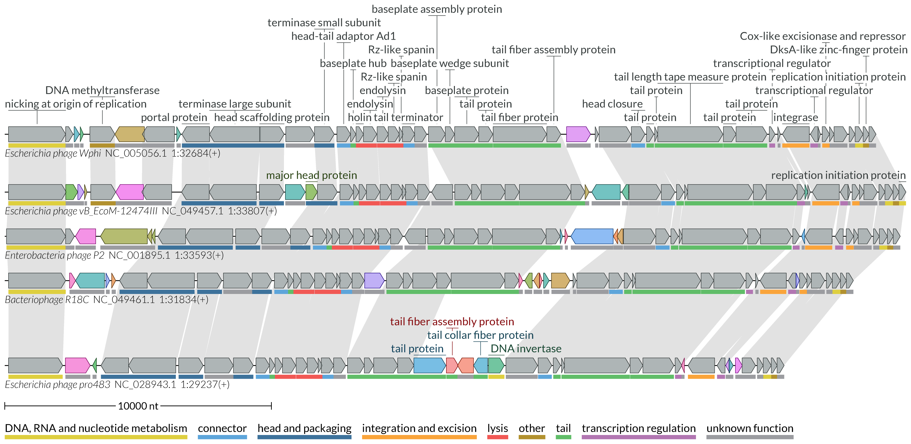
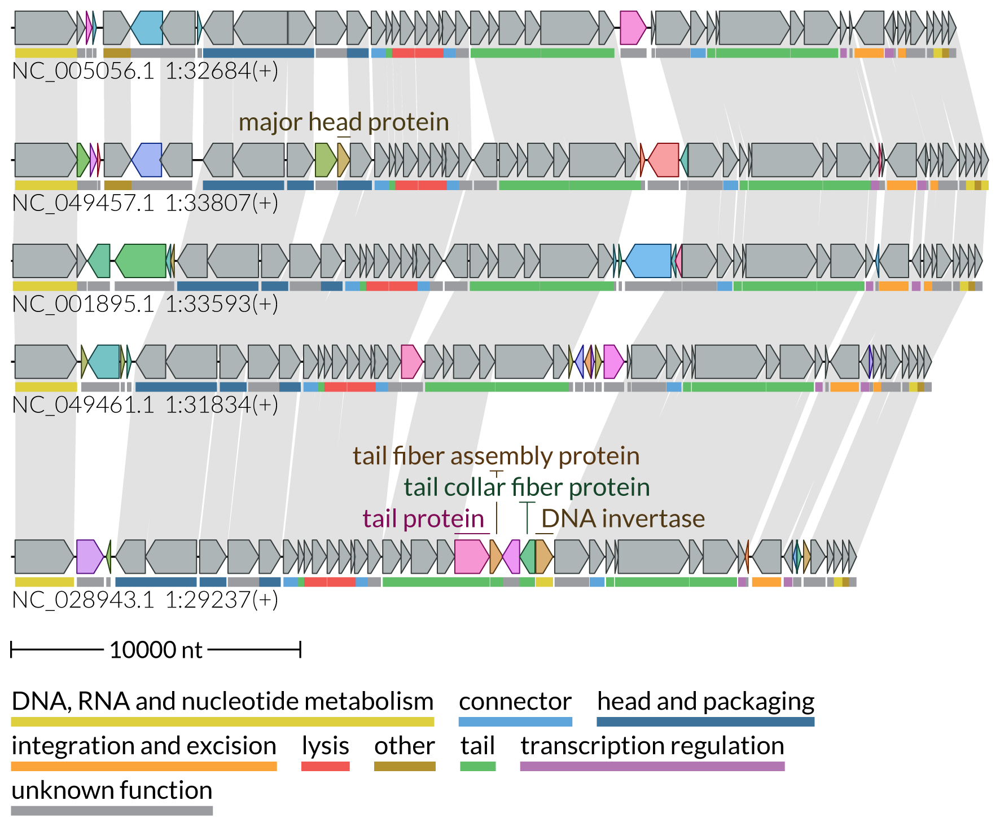
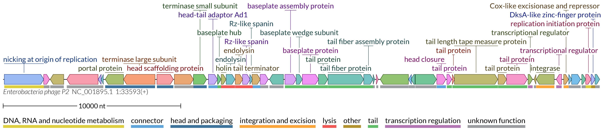
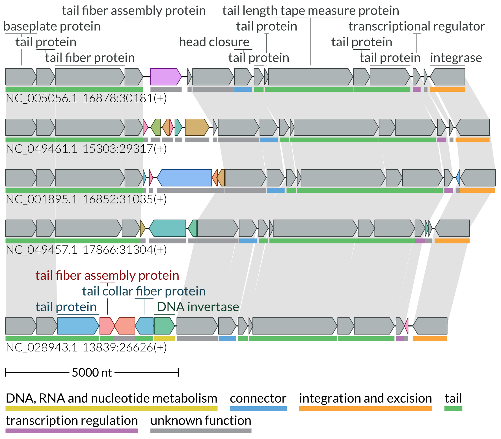
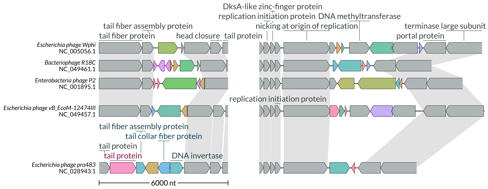

# Gallery

Here we show usage examples of the LoVis4u command-line interface. 
For description of parameters and modes shown on this page visit the [Example-driven guide page](https://art-egorov.github.io/lovis4u/ExampleDrivenGuide/cmd_guide/). 

## Sample data & Configuration files 

The necessary sample data as well as adjustable tool configuration files are provided by lovis4u at the post-install step with the command:    
`lovis4u --data` This copies the *lovis4u_data* folder to your working directory.


Also important to describe the set of editable configuration files with parameters already adjusted for different tasks and page layout:

- **A4p1** - adjusted for one-column portrait A4 page layout. Figure width - 90mm.
- **A4p2** - adjusted for two-column portrait A4 page layout. Figure width - 190mm.
- **A4L** - adjusted for landscape A4 page layout. Figure width - 240mm.
- **standard** - flexible width length, scale - 0.05 mm per nucleotide with minimal width - 80mm. 

???+ card_hearts "**A4 page layout examples**" 
	[***Corresponding PDF file***](gallery/img/A4_page.pdf){target="_blank"}
	{loading=lazy width="100%" } 
	

## The full-length visualisation of loci

### Miltiple sequences

**Visualisation with homology lines and category colours. Figure size: two-column of A4 page publication layout [190mm].**

```sh
lovis4u -gff lovis4u_data/guide/gff_files -hl --set-category-colour -c A4p2
```

{loading=lazy width="100%" }  

--- 

**Visualisation with homology lines and category colours. Figure. size: compact one-column A4 page visualisation without labelling of conserved proteins [90mm].**


```sh
lovis4u -gff lovis4u_data/guide/gff_files -hl --set-category-colour \
	--show-first-feature-label-for  -c A4p1
```

{loading=lazy width="500px" }  

---

### One sequence

**Visualisation of a single sequence with highlighted protein groups of homologues by different colours. Figure size: two-column A4 page publication layout [190mm].**

```sh
lovis4u -gff lovis4u_data/guide/single_gff_file -hl --set-category-colour -c A4p2 \
	--set-group-colour-for conserved
```

{loading=lazy width="100%" }  

## Visualisation of user-defined regions

**Visualisation of user-defined regions, one region per locus. Figure size: one-column A4 page layout [90mm].**

```sh
lovis4u -gff lovis4u_data/guide/gff_files -c A4p1 --locus-annotation-file lovis4u_data/guide/locus_annotation_table_demo_2.tsv \ 
	-cl-off -hl --set-category-colour
```

{loading=lazy width="500px" }  

**Visualisation of user-defined regions, two regions per locus. Figure size: two-column of A4 page publication layout [190mm].**


```sh
lovis4u -gff lovis4u_data/guide/gff_files  -hl -o lovis4u_output_m_loci  \
    --locus-annotation-file lovis4u_data/guide/locus_annotation_table_demo_1.tsv -cl-off -llp left  -slt
```

{loading=lazy width="800px" }  

---


