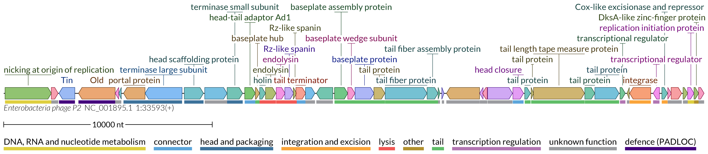

# Gallery

Here we show usage examples of the LoVis4u command-line interface. 
For description of parameters and modes shown on this page visit the [Example-driven guide page](https://art-egorov.github.io/lovis4u/ExampleDrivenGuide/cmd_guide/). 

## Sample data & Configuration files 

The necessary sample data as well as adjustable tool configuration files are provided by lovis4u at the post-install step with the command:    
`lovis4u --data` This copies the *lovis4u_data* folder to your working directory.


Also important to describe the set of editable configuration files with parameters already adjusted for different tasks and page layout:

- **A4p1** - adjusted for one-column portrait A4 page layout. Figure width - 90mm.
- **A4p2** - adjusted for two-column portrait A4 page layout. Figure width - 190mm.
- **A4L** - adjusted for landscape A4 page layout. Figure width - 240mm.
- **standard** - flexible width length, scale - 0.05 mm per nucleotide with minimal width - 80mm. 

???+ card_hearts "**A4 page layout examples**" 
	[***Corresponding PDF file***](gallery/img/A4_page.pdf){target="_blank"}
	{loading=lazy width="100%" } 
	

## The full-length visualisation of loci

### Miltiple sequences

**Visualisation with homology lines and category colours. Figure size: two-column of A4 page publication layout (190mm width).**

```sh
lovis4u -gff lovis4u_data/guide/gff_files -hl --set-category-colour -c A4p2
```

{loading=lazy width="100%" }  

--- 

**Visualisation with homology lines and category colours. Compact one-column A4 page figure without labelling of conserved proteins (90mm width).**


```sh
lovis4u -gff lovis4u_data/guide/gff_files -hl --set-category-colour \
	--show-first-feature-label-for  -c A4p1
```

{loading=lazy width="500px" }  

---

### One sequence

**Visualisation of a single sequence with highlighted protein groups of homologues by different colours. Two-column A4 page publication layout (190mm width).**

```sh
lovis4u -gff lovis4u_data/guide/single_gff_file -hl --set-category-colour -c A4p2 \
	--set-group-colour-for conserved
```

{loading=lazy width="100%" }  

## Visualisation of user-defined regions

**Visualisation of user-defined regions, one region per locus. One-column A4 page layout (90mm width).**

```sh
lovis4u -gff lovis4u_data/guide/gff_files -c A4p1 --locus-annotation-file lovis4u_data/guide/locus_annotation_table_demo_2.tsv \ 
	-cl-off -hl --set-category-colour
```

{loading=lazy width="500px" }  

**Visualisation of user-defined regions, multiple regions per locus.**


```sh
lovis4u -gff lovis4u_data/guide/gff_files  -hl -o lovis4u_output_m_loci  \
    --locus-annotation-file lovis4u_data/guide/locus_annotation_table_demo_1.tsv -cl-off -llp left  -slt
```

{loading=lazy width="800px" }  

### Non-coding features

**Visualisation of loci with non-coding features (tRNAs) and displaying their labels.**

```sh
lovis4u -gff lovis4u_data/guide/BaselSubset -laf lovis4u_data/guide/locus_annotation_table_trnas.tsv \
     -hl --set-category-colour -c A4p1 --show-first-noncoding-label
``` 
 
{loading=lazy width="530px" }  

---


## Visualisation of the Basel collection of phages

For demonstration of LoVis4u's capabilities (and because it is fun), I applied it to the entire Basel collection of 78 *Escherichia coli* phages (see [Maffei et.al. PLOS Biology](https://doi.org/10.1371/journal.pbio.3001424)).

```sh
lovis4u -gff lovis4u_data/guide/BaselCollection  -hl --set-category-colour -c A4p2 -fw 500
```

[***LoVis4u PDF file of the visualisation***](gallery/img/lovis4u_Basel.pdf){target="_blank"}

??? card_hearts "**Raster image**" 
	{loading=lazy width="100%" } 

This run also highlights one of LoVis4u key features—its ability to detect clusters of similar proteomes within the input data. Beyond visualisation, LoVis4u generates a matrix of pairwise proteome similarity (see the pipeline description page). The visualisation of this matrix for the Basel collection appears as follows:

{loading=lazy width="650px" }  


