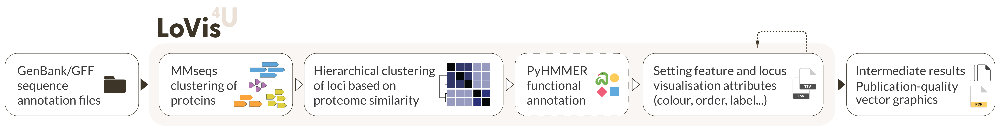

# Pipeline description

Here we describe in details each step of the LoVis4u workflow, which schematically is shown on the Figure 1. For description of generated files, visualisation, and frequently used parameters, see the [Example-driven guide page](https://art-egorov.github.io/lovis4u/ExampleDrivenGuide/cmd_guide/). 
{ width="100%" loading=lazy }  

## Defining groups of protein homologues and proteome filtering

The first step is reading input data in gff or genbank formats. While reading the files, we store all encoded protein sequences in a fasta file, which will be used as input for MMseqs clustering. 

After gff files are read, we use the [MMseqs2](https://github.com/soedinglab/mmseqs2) clustering pipeline with all encoded proteins as input. All the clustering parameters can be adjusted using the configuration file. By default, we use the following parameters: `--cluster mode 0 --cov-mode 0 --min-seq-id 0.25 -c 0.8 -s 7` (see [mmseqs documentation](https://mmseqs.com/latest/userguide.pdf) for a detailed description).

We then treat each cluster of proteins as *a group of homologues*. For each group we set the identifier (id) attribute as the id of the representative protein for the cluster.

While processing the MMseqs results we iterate over all proteomes and all encoded proteins of each proteome, setting the attribute ”group” for each CDS as id of cluster it belongs to. 

## Hierarchical clustering of proteomes

The second major step is ordering and clustering of proteomes. Firstly we build the matrix of proteome similarity. For each pair of proteomes, say $i^{th}$ and $j^{th}$ proteomes we have weight $w_{ij}:$
$$
w_{ij} = (\frac{\vert G_i \cap G_j \vert}{\vert G_i \vert} + \frac{\vert G_i \cap G_j|}{|G_j|})\cdot\frac{1}{2} = \frac{|G_i \cap G_j|\cdot(|G_i|+|G_j|)}{2|G_i||G_j|}; \,\, w_{ij}\in[0,1]; \, \, w_{ij} = w_{ji} \,\, \forall\,i,j
$$ 
where $|G_i|$, $|G_j|$ are lengths (number of unique elements) of the sets of protein groups of $i^{th}$ and $j^{th}$ proteomes, respectively. $|G_i \cap G_j|$ is the number of shared (overlapped) protein groups between $i^{th}$ and $j^{th}$ proteomes.  
The meaning of $w_{ij}$ is average value of two fractions: the first $|G_i \cap G_j|/|G_i|$ is the number of shared homologues normalised to the length of $i^{th}$ proteome set of protein groups, and the second $|G_i \cap G_j|/|G_j|$ - the same number of shared homologues with normalisation to the $j^{th}$ proteome. The average of the two normalisations gives the required symmetric property with respect to its indexes. That is, $w_{ij}$ is a metric of similarity of two genomes in terms of their proteome composition.

Then, for each pair of proteomes we calculate the pairwise distance value which is simply defined as: $d_{ij} = 1 - w_{ij}$. The matrix of distances is used then for hierarchical clustering using scipy library. The order of sequences for visualisation is defined by obtained dendrogram. Additionally, to define clusters of input sequences we use average linkage method and height cutoff which is set by default as 0.35. If you want to define the optimal order but consider all sequences to be member of one cluster, you can use `--one-cluster` optional argument. We treat each proteome cluster as a group of relatively more closely related proteomes, which we can use for our subsequent analyses.

## Defining protein group classes 

Within each proteome cluster we can find homologous protein groups that are encoded in different fractions of the proteomes. Those that are found in the majority of proteomes we call *“conserved”* (equivalent to “core” in pan-genome analyses). Those protein groups that are found in a relatively small fraction of proteomes then we call *“variable”* (equivalent to “cloud” in pan-genome analyses). Finally, those protein groups that are neither very variable nor very conserved, we refer to as *“intermediate”*  (“shell” in pan-genome analyses).

For each protein group $g_i$ within a proteome cluster $c$ that consists of $N_c$ proteomes, we the define protein group presence fraction as $f_i =  N_c^{g_i}/N_c$, where $N_c^{g_i}$ is the number of proteomes of $c$ community that contain the $g_i$ protein group. if $f_i \leq 0.25$ $g_i$ group class is set as *"variable"*, if $ 0.25 < f_i < 0.75$ then $g_i$ is *"intermediate"*, and, if $ f_i \geq 0.75 $ we say that $g_i$ is *"conserved"*. 

### Additional functional annotation

For additional annotation of proteins encoded either as cargo of annotated hotspot islands or as flanking genes we use [pyhmmer API](https://pyhmmer.readthedocs.io/en/stable/). The reason of using pyhmmer instead of MMseqs2 sequence vs profile search is that for several databases that are essential for hotspot protein annotation we have only *[hmmer](http://hmmer.org)* database of profiles available without provided MSA or HMM models compatible with hh-suite or MMseqs 🫤. In order to reduce the running time we use only representative proteins of each protein group as a query set for searching. As was defined above, each cluster of proteins is considered as a set of homologues, then, the search results are attributed to each protein group based on its representative sequence.

The list of used databases and their versions or date of retrieval: 

- Antimicrobial resistance genes (AMR): [AMRFinderPlus](https://www.ncbi.nlm.nih.gov/pathogens/antimicrobial-resistance/AMRFinder/): 02.05.2024.2
- Anti-Defence: [dbAPIS_Acr](https://bcb.unl.edu/dbAPIS/): 19.09.2023
- Defence systems (DefenseFinder): [DefenseFinder](https://defensefinder.mdmlab.fr): 1.2.4, [CasFinder](https://github.com/macsy-models/CasFinder): 3.1.0;
- Defence systems (PADLOC): [PADLOC](https://padloc.otago.ac.nz/padloc/systeminformation/): 23.10.2024
- Virulence factors: [VFDB](http://www.mgc.ac.cn/VFs/) : 10.05.2024

## Feature and Locus annotation tables 

The results of sequence clustering and information about proteins are saved as feature and locus annotation tables. They also cal be used as input if you have pre-defined values. See the example-driven guide for the details.

---
